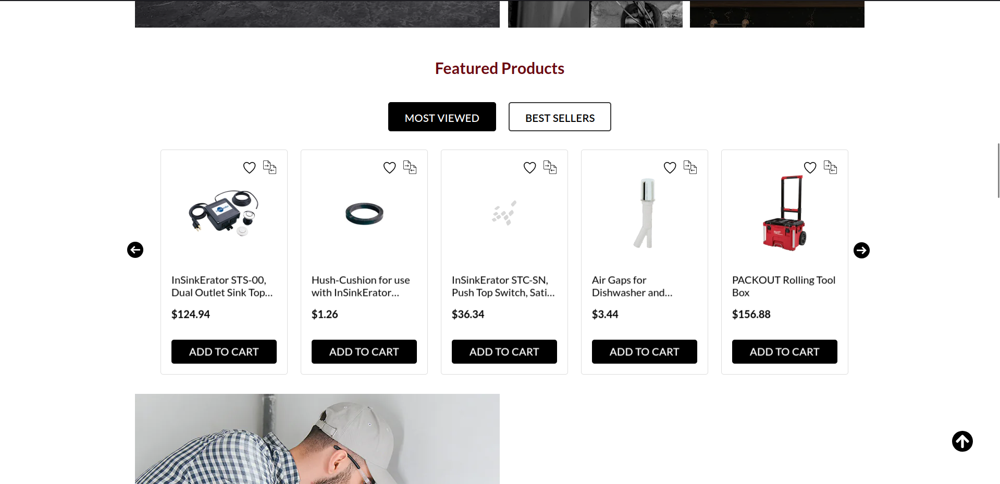
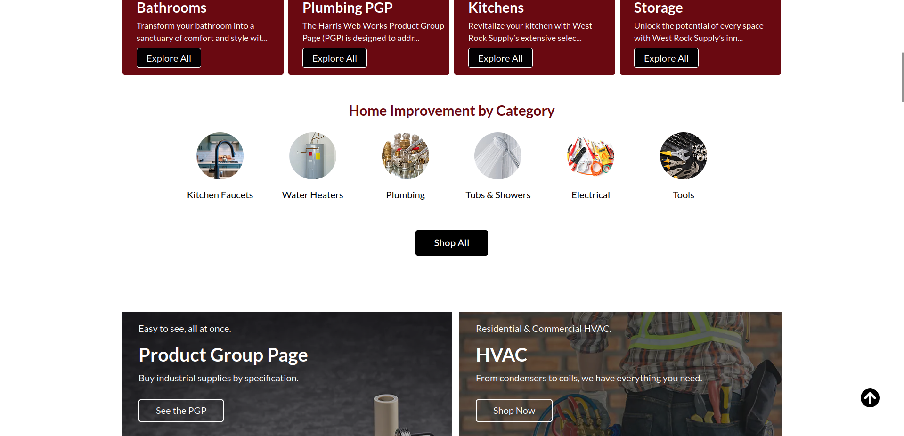

# Magento 2 Extension Portfolio — Case Studies

A suite of nine custom Magento 2 extensions built to cover content, navigation, merchandising, and catalog-presentation needs that Magento's core feature set does not address. Each was developed against real merchant requirements on production stores, and each is designed to be configured and operated by non-technical staff rather than requiring a developer for every change.

All nine share a common foundation module that provides a single grouped admin configuration tab and a shared admin menu root, so the suite presents as one coherent product rather than nine unrelated extensions.

---

> **Portfolio and confidentiality notice:** These are sanitized case studies of
> Magento 2 extensions that I developed or helped lead while working at
> [Harris Digital](https://github.com/harriswebworks).
>
> Production source code and client-specific implementations are private and
> remain the property of Harris Digital and/or its clients. This repository
> contains no proprietary source code, credentials, private repository
> addresses, customer data, production configuration, or confidential client
> information.

---

## Shared architecture and conventions

A consistent set of decisions runs through the whole suite:

- **Merchant-operable by design.** Anything a merchant might reasonably want to change — which items appear, where they appear, how they behave, what they are called — lives in admin configuration or entity data, never in theme files. Deployments are not required for content or merchandising changes.
- **Data-driven placement.** Several modules decide *where* to render by inspecting the current request at layout-load time and conditionally applying a layout handle, rather than requiring per-page theme XML. Targeting rules are configuration, not code.
- **Extend, don't fork.** Where core behaviour needed changing, the work is done through interception (plugins) and events rather than class rewrites, to reduce upgrade conflicts and improve maintainability across Magento upgrades.
- **Cache-correct output.** Blocks that render cacheable content declare cache identities and cache keys so their output invalidates properly under full-page cache; blocks that render customer-specific content are explicitly excluded from caching.
- **Contracts over concretes.** Entity-backed modules expose service contracts (data interfaces and repositories) so other modules integrate against a stable API rather than resource models.
- **Progressive rendering.** Where a page could load hundreds of rows, an initial subset is rendered server-side and the remainder is fetched on demand.

**Magento concepts used across the suite:** custom EAV attributes (category, product, and customer entities), declarative schema, data patches, UI-component grids and forms, admin ACL and menu integration, system configuration with scoped values, layout handles and layout XML, event observers, interception plugins, service contracts and repositories, custom front-end routers, widgets, block cache identities, image resizing with cached derivatives, and the WYSIWYG and image-uploader admin components.

---

## Detailed Case Studies

1. [Editorial Blog Platform](docs/editorial-blog-module.md)
2. [Custom Menu Manager](docs/custom-menu-manager.md)
3. [Homepage Category Showcase](docs/homepage-category-showcase.md)
4. [Glossary Module](docs/glossary-module.md)
5. [Product Group Page](docs/product-group-page.md)
6. [Dealer Branding Module](docs/dealer-branding-module.md)
7. [Slider and Banner Manager](docs/slider-banner-manager.md)
8. [Product Carousel Module](docs/product-carousel-module.md)
9. [Manufacturer Management](docs/manufacturer-management.md)

---

## 1. Blog Platform

**Business problem.** Merchants wanted to publish editorial content — buying guides, product explainers, regional news — to drive organic search traffic and support the catalog. Running a second CMS alongside Magento meant duplicated effort, inconsistent branding, and no path from an article to a purchase.

**Solution.** A full blogging platform inside Magento. Posts support multiple categories for topic-based browsing, separate excerpt and body content so listings never rely on HTML truncation, and first-class title, publish date, and author metadata enabling chronological archives, scheduled publishing, and author pages.

The commercially significant piece is **product association**: posts can be linked to catalog products, which produces a related-products block on the article and a related-articles block on the product page. Editorial content becomes a merchandising surface with a clear path from editorial content to relevant products, rather than a dead-end content silo.

**Multi-store.** Posts and categories are store-view scoped, so one installation serves different editorial content per brand, region, or language.

---

## 2. Menu Manager

**Business problem.** Magento's navigation is driven by the category tree. Any menu that isn't a category listing — footer link columns, utility navigation, curated mega-menu panels — required a developer to edit theme XML and templates. Marketing could not adjust navigation without a release.

**Solution.** An admin-managed menu builder using a two-level model: named menu containers, each holding an ordered set of items. Menus and their items are edited on a single admin screen.

Each item carries an active/inactive toggle (so navigation changes can be staged and switched on at launch), a link target behaviour setting, and a per-item CSS class — the last of which lets the theme style or icon individual entries without hard-coding selectors against link text.

**Rendering.** Menus are exposed through Magento's widget system, so a merchant can place any menu into any CMS page, block, or layout position through the standard widget instance UI with no developer involvement. Direct layout placement remains available for themes that need it.

**Performance.** The module registers its own dedicated cache type. Rendered menus are cached independently of full-page cache and can be flushed on their own from Cache Management — a navigation change doesn't require invalidating the entire page cache.

**Magento concepts:** widget declaration and source models, service contracts, custom cache type registration, admin ACL, mass actions.

---

## 3. Homepage Category Showcase

**Business problem.** The homepage needed a curated set of category tiles with their own artwork — not the thumbnails already attached to categories for listing pages. The usual approach, a hand-built CMS block, meant the tile list drifted out of sync with the real category tree, links broke silently when categories were renamed or moved, and every change was a manual HTML edit.

**Solution.** Curation happens *in the category tree itself*. Custom category attributes add a "show on homepage" flag plus dedicated homepage image and icon fields, grouped into their own section on the category edit form. The homepage block reads directly from the category collection, which significantly reduces the risk of stale category links and means the merchant does not need to edit HTML.

Because the image fields are separate from the standard category image, merchants can use tall, art-directed homepage artwork without affecting how the category renders elsewhere. The icon variant supports compact icon-grid layouts on the same data.

The same block also drives child-category listings on category pages, so one dataset serves two placements.

**Multi-store.** All three attributes are store-view scoped — different store views can promote different categories with different artwork.

**Performance.** Images are resized on demand and the derivatives cached, so full-size uploads never reach the browser. The block declares cache identities and a cache key, so it invalidates correctly when a category changes but is served from full-page cache otherwise.

**Admin integration.** Getting custom image fields to behave like native ones on the category form required interception on both the form's data provider (so existing images preview correctly when the form loads) and the save controller (so uploads and removals are processed correctly), plus dedicated upload endpoints.

**Hyvä.** Full support — see the Hyvä section below.

**Magento concepts:** category EAV attributes via data patch, UI-component form modification, `afterPrepareMeta`/`afterGetData` and save-controller plugins, custom upload controllers, cache identities, image adapter resizing.

---

## 4. Glossary

**Business problem.** Technical and industrial catalogs are full of specification terms, materials, and acronyms that buyers don't share a vocabulary for. Definitions scattered across product descriptions and PDFs weren't findable, weren't consistent, and weren't indexable.

**Solution.** A managed terminology database rendered as a single scannable A–Z reference page. Terms are maintained in a standard admin grid with search, filtering, paging, and export; the storefront page groups them automatically by initial letter, buckets numeric and symbol-initial terms separately, and offers both an alphabet jump bar and a client-side search filter.

The page's heading and introduction are configurable per store, so the same term set can be framed differently for different audiences.

**Routing.** A custom front-end router resolves the glossary to a clean, friendly URL without requiring URL rewrites to be created or maintained.

**Accessibility and performance.** Grouping and sorting happen server-side; the letter navigation and search filter operate on already-rendered content, so the page is fully readable and navigable without JavaScript and there is no loading state before content appears.

**Hyvä.** Supported — see the Hyvä section below.

**Magento concepts:** declarative schema, UI-component grid and form, admin ACL and menu, custom front-end router, scoped system configuration.

---

## 5. Product Group Page Catalog

**Business problem.** For catalogs where products differ by specification rather than by style — fittings, fasteners, filters, cable assemblies — a standard image-grid product listing is the wrong presentation entirely. Buyers arrive knowing the dimension or rating they need and want to compare variants side by side. A grid of near-identical photographs forces them into dozens of product pages to find one number.

**Solution.** Selected category pages render instead as a specification table: products become rows, and merchant-chosen product attributes become the columns. Buyers scan and compare in one view, sort by the dimension that matters to them, and add to cart directly from the table.

Which categories use this presentation is a configuration setting, and which attributes become columns is chosen per category on the category edit form — so extending the pattern to a new product family requires no development work.

**Key design decisions:**

- **Non-invasive activation.** An observer inspects each category page request and applies an alternate layout handle only for configured categories. Standard categories are untouched, and no per-category theme XML exists to maintain.
- **Mobile presentation is a choice, not a compromise.** A wide specification table can't simply reflow to a phone. Rather than forcing one answer, the merchant selects per store whether small screens receive a restructured table or a card grid.
- **Progressive loading.** Large groups render an initial, configurable number of rows per child category, with the remainder fetched asynchronously behind a merchant-labelled "view all" control. Lazily-loaded rows arrive fully interactive, with working add-to-cart and compare actions.
- **Attribute-aware sorting.** Attributes designated as dimensional are handled distinctly from descriptive ones, so numeric specifications sort in numeric order rather than as strings.

**Hyvä.** Supported — see the Hyvä section below.

**Magento concepts:** category EAV attribute with custom source and backend models, UI-component select over an attribute source, layout-handle injection via observer, extended catalog list block, AJAX controller returning rendered block HTML, RequireJS asset management.

---

## 6. Dealer Logo (B2B Co-Branding)

**Business problem.** On a B2B store serving dealers and franchisees, each account wanted the storefront to feel like *their* portal rather than a generic supplier site — a small but persistent signal that reinforces the relationship on every page.

**Solution.** Each customer account can carry its own logo. When that customer is signed in, the storefront header shows their logo in place of the usual account name; visitors and accounts without a logo see the standard treatment, so there is no broken or empty state.

The logo can be set from either side: an administrator uploads it on the customer's behalf, or the customer supplies it during registration or from account settings.

**Performance.** Uploaded logos are resized once to a constrained display size — preserving aspect ratio and transparency — and the derivative is cached on disk. Subsequent requests serve the cached file, so an oversized upload is never sent to the browser and the resize cost is paid only once. The block itself is explicitly non-cacheable, since its output is customer-specific.

**Integration.** Header placement is left to the consuming theme, so the integrator controls exactly where the logo sits rather than inheriting a fixed position.

**Magento concepts:** customer EAV attribute with file input, registration in admin and storefront customer forms, image adapter resizing with on-disk caching, customer session handling, cacheability control.

---

## 7. Slider / Banner Manager

**Business problem.** Promotional sliders were placed by developers in theme XML. Every campaign — a seasonal banner on one category, a promotion on a specific landing page — became a ticket and a deployment. Merchants also had no way to give mobile visitors different artwork, so desktop banners were letterboxed or cropped badly on phones.

**Solution.** Sliders are bound to *where they should appear* rather than being placed in code. The merchant creates a slider, chooses a target — a specific CMS page, a category, or a named route — and the module injects it on matching pages automatically. No developer involvement, no deployment.

**Key design decisions:**

- **Separate mobile artwork.** Every slide carries both a desktop and a mobile image, so campaigns are art-directed for each form factor rather than scaled and cropped.
- **Behaviour is data, not code.** Autoplay, navigation arrows, pagination dots, pause-on-hover, and lazy loading are all stored per slider and set in the admin. Two sliders on the same site can behave completely differently without a theme change.
- **Two carousel engines, selectable per slider.** The module bundles two established carousel libraries and the merchant picks per slider, so a specific campaign's motion requirements never force a global theme decision.
- **Rich, dynamic captions.** Slide caption content is processed through Magento's CMS directive filter, so merchants can reference media and store URLs in captions and have them resolve correctly across environments.

**Accessibility.** Alt text is a first-class field on every slide rather than an afterthought, so promotional imagery is described to screen readers and search engines.

**Performance.** The slider block declares cache identities and a cache key so it participates correctly in full-page cache. Per-slider lazy loading limits initial payload on slide-heavy carousels.

**Admin experience.** Sliders and slides have separate managed grids with image thumbnails, per-row actions, and mass operations. Because the placement mechanism is powerful but non-obvious, the configuration screen carries an in-admin instructions panel explaining how to target and invoke a slider — documentation where the person doing the work will actually see it.

**Magento concepts:** declarative schema, layout-handle injection via observer, UI-component listings with thumbnail and action columns, mass actions, custom system-configuration field renderer, CMS directive filtering, cache identities.

---

## 8. Product Slider

**Business problem.** The homepage needed rotating product carousels — featured items, new arrivals, most viewed, best sellers — and marketing needed to tune them continuously: how many products, whether prices show, whether add-to-cart appears, what each section is called. Hard-coded carousels meant a developer for every adjustment.

**Solution.** Four independent carousels, each with a full set of admin controls. Featured and new-arrival membership are merchant-curated through simple product flags, while most-viewed and best-seller sets derive from Magento's own reporting aggregations — combining editorial control where the merchant wants it with automatic behaviour where data should decide.

Every carousel independently exposes: enable/disable, product count, section heading, autoplay, price display, add-to-cart display, wishlist/compare display, review-rating display, arrow controls, pagination dots, and infinite loop. Nothing about presentation requires a deployment.

**Layout.** The featured carousel sits prominently on its own; the remaining three are grouped into a tabbed container to conserve vertical space, with tab order and styling driven by layout arguments rather than template edits.

**Reuse over reimplementation.** Wishlist, compare, and B2B requisition-list actions reuse Magento's own components rather than reimplementing them, so each respects both this module's display toggle and Magento's own feature switches — helping the carousel respect Magento's globally configured feature availability.

**Performance.** The module registers a dedicated image type at the exact rendered dimensions, so Magento generates correctly-sized thumbnails rather than the browser downscaling full catalog images — a meaningful payload reduction on a homepage showing dozens of products.

**Magento concepts:** product EAV attributes via data patch, report aggregation collections, block groups and layout arguments, `ifconfig`-gated child blocks, custom image type registration, scoped system configuration.

---

## 9. Manufacturer / Brand Pages

**Business problem.** Magento treats manufacturer as a simple dropdown attribute: a label with no image, no description, no page of its own. Brand-led catalogs need real brand destinations — logo, copy, SEO metadata, and a filtered product listing — both as landing pages for brand-name search traffic and as a browsing path for customers who shop by brand.

**Solution.** A full brand entity with its own admin management, storefront landing pages, and product association.

Each brand carries a name, logo, teaser and rich long-form description, per-brand SEO metadata, a display order, an active/inactive status, and a flag controlling whether it appears in the homepage brand strip.

**SEO.** Brands resolve to clean, brand-named URLs through a custom front-end router, with a configurable URL suffix so the pattern matches whatever convention the rest of the site uses. Store-level default metadata is configurable and per-brand values override it, so a catalog of hundreds of brands gets sensible metadata by default without hand-writing every entry.

**Product association.** A multi-value product attribute sources its options from the brand records themselves, so products associate with one or more brands and each brand page lists its products. Brand data is exposed through service contracts, so other modules integrate against a stable API.

**Multi-store.** SEO defaults and the URL suffix are configurable per website and store view.

**Admin experience.** A managed listing with inline editing, mass delete, and mass status change, plus a rich-text editor for brand copy and a validated image uploader with a staged upload directory.

**Performance.** The brand listing declares cache identities so it participates correctly in full-page cache, and is paginated rather than rendering an unbounded catalog of brands.

**Magento concepts:** custom entity with resource model and collection, service contracts and repository, UI-component listing with inline edit and mass actions, WYSIWYG form element, image uploader with staged directories, custom front-end router with URL suffix handling, product attribute with array backend and custom source, cache identities.

---

## Cross-cutting engineering

### Hyvä compatibility approach

Four of the nine modules ship first-class Hyvä support, and the approach is deliberate rather than a port.

Rather than maintaining a separate Hyvä fork of each module, the modules ship **parallel templates and layout handles alongside the Luma versions in the same codebase**. The block and model layer is shared entirely; only the presentation layer differs. A store can switch themes without switching module versions, and a fix to business logic lands in both presentations at once.

The showcase module goes furthest, registering itself with Hyvä's Tailwind compilation step through Hyvä's own configuration event and shipping its own Tailwind configuration and source stylesheet. This means its utility classes are discovered and compiled automatically when the theme builds — the integrator doesn't have to manually add the module to a Tailwind content path, which is the usual source of "styles work in dev, vanish in production" bugs on Hyvä projects.

Where Hyvä templates exist, they are hand-written for Hyvä's Alpine.js and Tailwind idiom rather than being Luma templates with the jQuery stripped out — the interactive components use Alpine rather than RequireJS-loaded widgets.

The remaining modules are Luma-only and are documented as such, so integrators know what they're getting before installation rather than discovering it during a build.

### Multi-store support

Multi-store was treated as a requirement, not a feature, and applied at the correct level in each case:

- **Store-view-scoped entity data** where content genuinely differs per store — the blog's posts and categories, and the showcase module's per-category promotion flag and artwork. A multi-brand or multi-language operation runs genuinely different content from one installation.
- **Scoped system configuration** throughout — nearly every setting across the suite is exposed at default, website, and store-view level, so behaviour and copy can be tuned per storefront without duplicating data.
- **Store-aware defaults with per-record overrides** for SEO metadata, so large catalogs get correct defaults automatically while individual records stay customisable.

Where a module's data is intentionally global rather than store-scoped, that is a documented, deliberate decision rather than an oversight.

### Performance work

- **Correct cache participation.** Every block rendering cacheable content declares cache identities and an explicit cache key, so output is tagged and varied properly under full-page cache — invalidated when its underlying data changes, served from cache otherwise. Customer-specific blocks are explicitly marked non-cacheable rather than accidentally caching one customer's content for another.
- **A dedicated cache type** for the menu manager, so navigation changes flush independently instead of invalidating full-page cache site-wide.
- **Right-sized images.** Registered image types at exact rendered dimensions, plus on-demand resizing with cached derivatives, so full-size uploads never reach the browser and resize cost is paid once rather than per request.
- **Progressive loading** on specification tables, where an initial configurable subset renders server-side and the remainder loads asynchronously — keeping time-to-first-paint flat regardless of group size.
- **Bounded queries.** Product counts, page sizes, and initial load limits are configurable and always bounded; no module renders an unbounded collection.
- **Server-side grouping and sorting** wherever it can be done at render time rather than shipped to the client as work.

### Accessibility work

- **Alt text as a first-class field** on slider images, so promotional imagery is described to assistive technology and search engines rather than being decorative-by-default.
- **Content readable without JavaScript.** The glossary's grouping, alphabet navigation, and definition list are rendered server-side; the search filter progressively enhances already-present content rather than gating it.
- **Semantic structure** in generated markup — real headings, lists, and links — so screen-reader navigation and keyboard traversal work without ARIA patching.
- **Merchant-controlled labelling.** Section headings and control labels are configurable rather than hard-coded, so stores can supply clear, translated text instead of inheriting developer defaults.

---

## My Responsibilities

I directly developed several of these Magento 2 extensions and later led
enhancements, maintenance, and Hyvä compatibility work for others as part of
the Harris Digital engineering team.

My responsibilities included:

- Technical planning and Magento module architecture
- PHP backend development and service-layer implementation
- Magento administration grids, forms, ACL, and configuration
- JavaScript interactions and PHTML template development
- LESS-based Luma storefront styling
- Hyvä-compatible templates using Alpine.js and Tailwind CSS
- Product, category, and customer EAV attribute development
- Multi-store and store-view-scoped functionality
- Performance, caching, image optimization, and progressive loading
- Accessibility improvements and responsive storefront development
- Debugging, deployment, maintenance, code review, and developer guidance

Where work involved multiple developers, these case studies describe my
contribution and technical responsibilities rather than claiming sole
authorship.

## Screenshots

The screenshots below use demonstration data and illustrate selected
storefront and administration functionality from the extension case studies.

### Glossary Module

A searchable A–Z terminology interface designed for technical and
industrial ecommerce catalogs.

  

### Product Carousel

Configurable Magento product carousels supporting featured products,
most-viewed products, best sellers, pricing, cart actions, wishlist,
compare, and merchant-controlled presentation.

  

### Product Group Page

A specification-oriented catalog presentation designed for product
families where customers compare technical attributes rather than
product appearance.

  

  

### Homepage Category Showcase

Category-driven homepage merchandising controlled directly through
Magento category administration.

  

> Screenshots use demonstration data. Production source code, customer data,
> credentials, private repository information, and confidential client
> information are intentionally excluded.

## Results

These extensions were created to solve real merchant requirements involving
content management, navigation, catalog presentation, merchandising, B2B
personalization, brand discovery, and multi-store operations.

The work reduced the need for developers to perform routine content and
merchandising changes by moving relevant controls into the Magento
administration. Selected extensions were also prepared for possible commercial
distribution through Harris Digital.

Specific client names, production source code, private repositories,
credentials, customer information, and confidential implementation details are
intentionally excluded.
