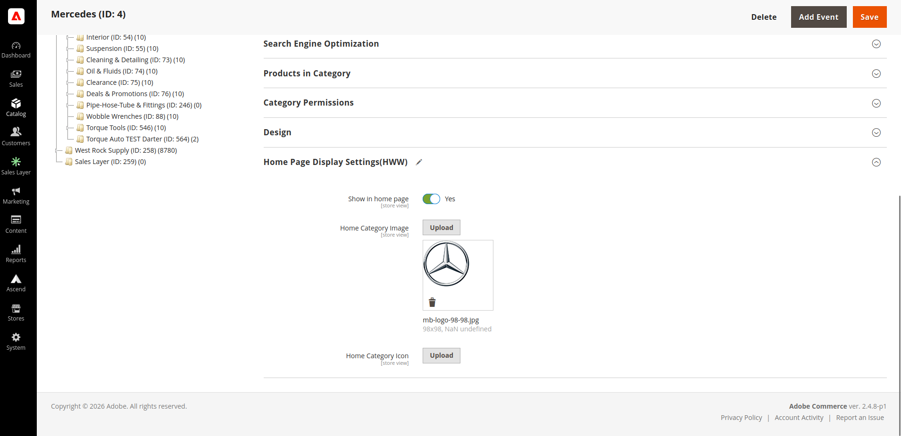

# Homepage Category Showcase

*Curated homepage category tiles maintained directly from the category tree, helping storefront merchandising stay aligned with the catalog.*

## Business problem

The homepage needed a curated set of category tiles with their own artwork — deliberately art-directed imagery, not the thumbnails already attached to categories for listing pages.

The usual approach is a hand-built CMS block containing hard-coded links and images. In practice that block rots: the tile list drifts out of sync with the real category tree, links break silently when categories are renamed, moved, or disabled, artwork lives in an unmanaged media folder, and every change is a manual HTML edit by someone comfortable editing HTML. Nobody notices a broken tile until a customer reports it.

## Solution

Curation happens **in the category tree itself**. Custom category attributes add a "show on homepage" flag plus dedicated homepage image and icon fields, grouped into their own clearly-labelled section on the category edit form. The homepage block reads directly from the category collection, filtered on that flag.

The consequences follow from the data model rather than from discipline:

- Links are generated from live category data, which significantly reduces the risk of stale category links when categories are renamed or moved. Rename or move a category and the tile follows.
- A disabled or deleted category disappears from the homepage automatically.
- The merchant does not need to edit HTML — promoting a category is a checkbox on a screen they already use.

**Separate artwork fields.** The homepage image is distinct from the standard category image, so merchants can use tall, art-directed homepage artwork without affecting how that category renders in listings, breadcrumbs, or navigation. The icon variant supports compact icon-grid layouts driven by the same underlying data — one curation decision, two presentations.

**Reuse.** The same block also drives child-category listings on category pages, so a single dataset and a single code path serve two placements.

## Admin integration

Making custom image fields behave like native ones on the category form was the bulk of the engineering. Magento's category form is a UI component with its own data provider and a save controller that pre-processes image payloads; custom image attributes are not handled by either. Two interception points were needed:

- On the **form's data provider**, so an already-uploaded image previews correctly when the form loads rather than appearing empty and being wiped on the next save.
- On the **save controller**, so uploads, replacements, and removals are each processed correctly, including the case where a merchant clears an image.

Dedicated upload endpoints handle the file transfers themselves. The result is that the fields look and behave exactly like Magento's own category image field, which is the point — merchants shouldn't have to learn that two visually identical controls work differently.

## Multi-store

All three attributes are store-view scoped. Different store views can promote different categories, with different artwork, from the same catalog — supporting regional merchandising and multi-brand operations without duplicating categories.

## Performance

- Images are **resized on demand and the derivatives cached** on disk, so full-size uploads never reach the browser and the resize cost is paid once rather than per request.
- The block declares **cache identities and an explicit cache key**, so it is served from full-page cache normally but invalidates correctly the moment an underlying category changes.
- Collection queries accept depth, sort, and page-size arguments from layout, so the block never fetches an unbounded category tree.

## Hyvä

Full support, and the most thorough in the suite. Beyond shipping parallel Hyvä templates and layout handles, this module **registers itself with Hyvä's Tailwind compilation step** through Hyvä's own configuration event and ships its own Tailwind configuration and source stylesheet.

That registration is what makes it genuinely drop-in: its utility classes are discovered and compiled automatically when the theme builds, so the integrator doesn't have to manually add the module to a Tailwind content path. Forgetting that step is the usual cause of "styles work in dev and vanish in production" on Hyvä projects, and it fails silently.

## Magento concepts used

Category EAV attributes added via data patch, UI-component form modification, data-provider and save-controller interception plugins, custom admin upload controllers, block cache identities and cache keys, image adapter resizing with cached derivatives, Hyvä configuration event integration.

## Screenshots

### Magento Administration

Custom category fields allow merchants to control homepage visibility,
dedicated promotional artwork, and icons directly from the category editor.

  

### Storefront Result

The selected categories are rendered automatically from category configuration
rather than being maintained manually in CMS HTML.

  

     
---

[← Back to overview](../README.md)
