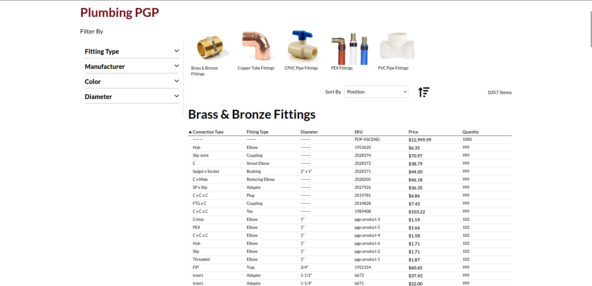
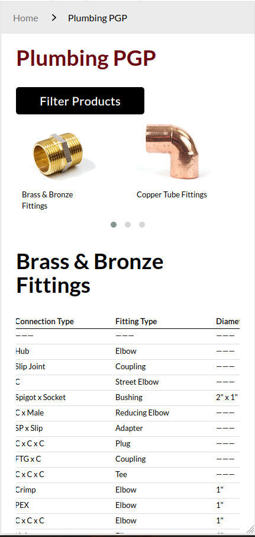

# Product Group Page

*Specification-table category listings for catalogs where buyers compare by dimension rather than by style.*

## Business problem

For catalogs where products differ by specification rather than by appearance — fittings, fasteners, filters, cable assemblies, seals — a standard image-grid product listing is the wrong presentation entirely.

Buyers in these categories arrive already knowing the dimension, rating, or material they need. They want to compare variants side by side and find the one row that matches. A grid of near-identical photographs gives them nothing to compare: the products look the same, the differentiating value is buried on the product page, and finding the right variant means opening a dozen tabs. Merchants in this space routinely lose orders to a competitor whose site shows a table, or to a PDF catalog.

## Solution

Selected category pages render as a **specification table** instead of a product grid. Products become rows; merchant-chosen product attributes become the columns. Buyers scan and compare in one view, sort by the dimension that matters to them, and add to cart directly from the table without visiting a product page at all.

Two things are merchant-controlled, which is what makes the pattern extensible without development work:

- **Which categories** use this presentation is a configuration setting.
- **Which attributes become columns** is chosen per category, on the category edit form, from the store's own attribute list.

Applying the pattern to a new product family is therefore a configuration task, not a project.

## Key design decisions

**Non-invasive activation.** An observer inspects each category page request and applies an alternate layout handle only for configured categories. Standard categories are completely untouched — no plugin runs against their rendering, no template is overridden, and there is no per-category theme XML to maintain as the catalog grows. If the feature is switched off, the site returns to stock behaviour with no residue.

**Mobile presentation is a choice, not a compromise.** A wide specification table cannot simply reflow onto a phone; something has to give. Rather than imposing one answer on every merchant, the module lets each store choose whether small screens receive a restructured table or a card grid. Which is correct depends on how many columns matter to that catalog's buyers — a decision the merchant is better placed to make than the developer.

**Progressive loading.** Large groups render an initial, configurable number of rows per child category, with the remainder fetched asynchronously behind a merchant-labelled "view all" control. This keeps time-to-first-paint flat regardless of how large a group is. Critically, lazily-loaded rows arrive **fully interactive** — with working add-to-cart and compare actions — rather than as inert markup that silently drops functionality below the fold.

**Attribute-aware sorting.** Attributes designated as dimensional are handled distinctly from descriptive ones, so numeric specifications sort in numeric order. Without this, string sorting puts 10 before 9, which in a specification table is not a cosmetic problem — it makes the table untrustworthy for exactly the task it exists to support.

## Multi-store

Category targeting, mobile layout choice, load limits, and control labelling are all scoped per website and store view, so the same catalog can present differently across storefronts serving different markets.

## Performance

Progressive loading with a configurable initial limit; server-side grouping; bounded queries throughout. The ajax endpoint returns rendered markup for a single child-category block rather than a full page, so the incremental cost of "view all" is proportional to what's actually being added.

## Hyvä

Supported. Every storefront template — the listing, the product view, child-category rendering, and the layer navigation — has a Hyvä counterpart alongside the Luma version, sharing the same block layer.

## Magento concepts used

Category EAV attribute with custom source and backend models, UI-component select over an attribute source, layout-handle injection via an event observer, extended catalog product list block, ajax controller returning rendered block HTML, RequireJS asset management, scoped system configuration.

## Screenshots

### Desktop Specification Table

The desktop presentation gives buyers a wide comparison table with
merchant-selected technical attributes, layered navigation, sorting,
pricing, inventory information, and product actions.

  

### Responsive Mobile Presentation

The mobile presentation reorganizes the same technical catalog experience
for narrow screens while retaining product-family navigation and
specification comparison.

  

---

[← Back to overview](../README.md)
